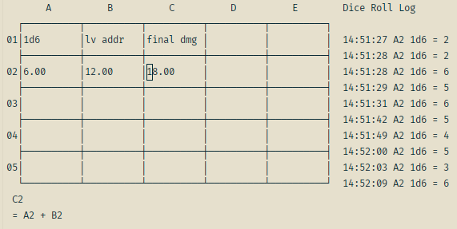

# SpreadSheetsCS

A simple console based spredsheet editor with basic dice rolling syntax

## Cell Math

use = to denote an equasion
for example
`=A1 + A2`

for dice rolls, use
`=1d6`

the 1 indicates how many rolls to sum togeather
the 6 indicates how many sides are on the dice we roll

for more complex math, you can use the equasions and cells
`=1d6 + 1d2 + 1`

## Internals

This uses a pratt parser and regex based lexer, and a simple stack based compiller, Cell expressions are compiled into a simple list of instructions that a stack vm evaluates, the expression system is fairly decoupled from the Spreadsheets ui portion

